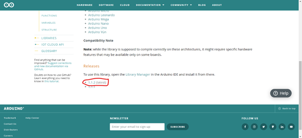
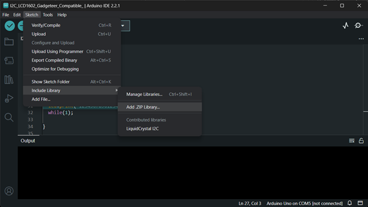
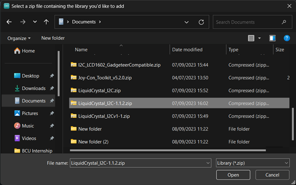
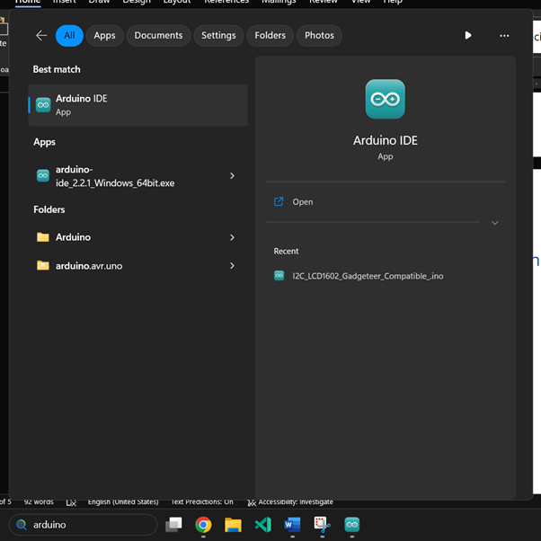
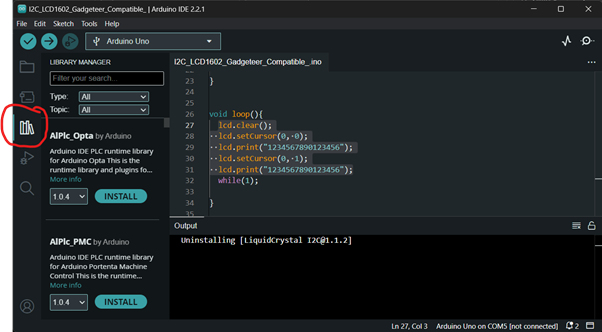
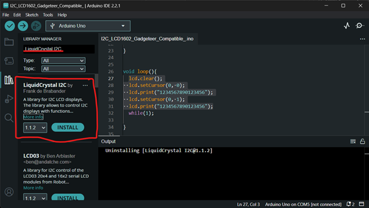

# **How To install Arduino Library**

## Installing Arduino libraries through website

For this tutorial I will be installing the I2C LCD screen module.

First Download the 1.1.2 I2C LCD Screen zip file using the website below

[https://www.arduino.cc/reference/en/libraries/liquidcrystal-i2c/](https://www.arduino.cc/reference/en/libraries/liquidcrystal-i2c/)

Once the file has been downloaded, open the Arduino IDE software, and click on Sketch on the toolbar, go to include Library, and select add .ZIP library…

Find the LiquidCrystal\_I2C-1.1.2.zip in the explorer (most likely to be in the download folder) and click open.

Confirm the library has been installed in the output.

## Installing a Library using the Arduino IDE

First open up the Arduino IDE

Click on the third icon (looks like a book)

Search for “LiquidCrystal I2C” in the search bar click install on the first library by Frank de Brabander.

