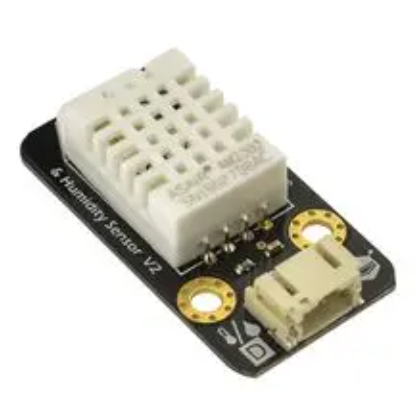
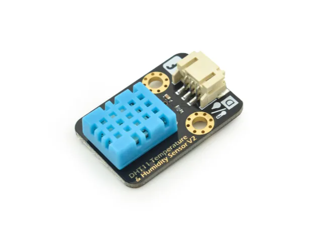
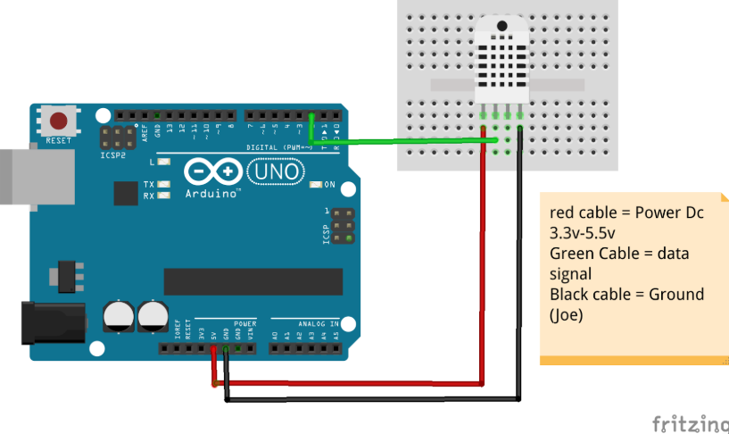

# DHT11 and DHT22 Temperature and Humidity Sensor

## 1. How it works
The DHT11 and DHT22 is a **digital temperature and humidity sensor** with an internal calibrated sensor and signal processor.

- It measures **temperature and humidity** and sends the data digitally
- Communication is done through a **single DATA pin**
- Arduino reads the data using a dedicated **DHT sensor library**
- The required library can be installed via **Arduino Library Manager**
- The sensor should not be read more frequently than **once every 2 seconds**

<p align="center">
  
</p>
<p align="center">
  
</p>

---

## 2. How to connect

### Pin definition (3-pin version)

When facing the front of the sensor (with holes visible), from **left to right**:

| Wire color | Function |
|----------|----------|
| Green | DATA |
| Red | VCC (3.3–5V) |
| Black | GND |

### Components required
- Arduino (UNO / Nano / Mega)
- DHT22 sensor (3-pin)
- Breadboard
- Jumper wires

### Wiring steps
1. Insert the DHT11 or DHT22 into the breadboard
2. Connect **Green (DATA)** to Arduino **D2**, aligned with the test code below
3. Connect **Red (VCC)** to Arduino **5V**
4. Connect **Black (GND)** to Arduino **GND**



> Note: Most 3-pin DHT22 modules already include a pull-up resistor.  
> No external resistor is required.

---


## 3. Test code

> Required library:  
> Install **DHT sensor library** by Adafruit using Arduino Library Manager  
> (The Adafruit Unified Sensor library will be installed automatically)

```cpp
#include <DHT.h>

#define DHTPIN 2
#define DHTTYPE DHT22 // Change into '11' if using DHT11 Sensor

DHT dht(DHTPIN, DHTTYPE);

void setup() {
  Serial.begin(9600);
  dht.begin();
}

void loop() {
  delay(2000);  // Minimum delay between readings

  float humidity = dht.readHumidity();
  float temperature = dht.readTemperature(); // Celsius

  if (isnan(humidity) || isnan(temperature)) {
    Serial.println("Failed to read from DHT22 sensor!");
    return;
  }

  Serial.print("Humidity: ");
  Serial.print(humidity);
  Serial.print(" %\t");

  Serial.print("Temperature: ");
  Serial.print(temperature);
  Serial.println(" °C");
}
```
## 4. How to verify

1. Upload the code to Arduino  
2. Open **Serial Monitor** (9600 baud)  
3. Observe temperature and humidity values updating every 2 seconds  

### Typical readings
- Temperature: 15 – 35 °C (room environment)  
- Humidity: 30 – 70 %  

*(Values vary depending on environment.)*

---

## 5. Notes / Supplement

- The **DATA** pin must be connected to a **digital pin**
- Do not read the sensor faster than **once every 2 seconds**
- If values show **NaN**, check wiring and library installation
- The sensor supports **Celsius and Fahrenheit** (via library functions)
