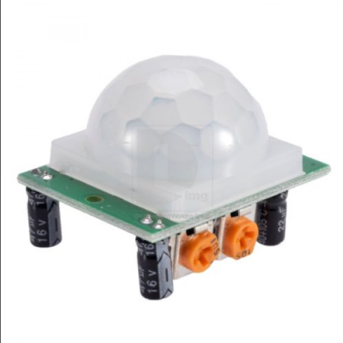
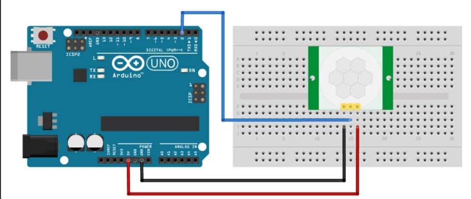

# PIR Motion Sensor

## 1. How it works



A PIR (Passive Infrared) sensor detects **motion of warm objects**, such as the human body.

- Humans emit infrared radiation
- When a person moves in front of the sensor, the infrared pattern changes
- The PIR sensor detects this change and outputs a signal
- The output is a **digital signal** (HIGH or LOW)

The sensor does **not** detect stationary objects, only motion.

---

## 2. How to connect

### Components required
- Arduino (UNO / Nano / Mega)
- PIR motion sensor (e.g. HC-SR501)
- Jumper wires
- Breadboard (optional)



### Pin definition  
(When facing the sensor with the white dome toward you — check silkscreen on your module)

| PIR Pin | Function | Arduino |
|------|--------|--------|
| VCC | Power | 5V |
| OUT | Signal output | D2 |
| GND | Ground | GND |

### Wiring steps
1. Connect **VCC** on PIR to **5V** on Arduino  
2. Connect **GND** on PIR to **GND** on Arduino  
3. Connect **OUT** on PIR to **digital pin D2**

> Note: Pin order may vary between modules. Always verify labels on the sensor.

- PIR output is **digital**, not analog  
- Do **not** connect PIR OUT to A0

---

## 4. Test code

```cpp
int pirPin = 2;      // PIR OUT connected to D2
int pirState = LOW;

void setup() {
  Serial.begin(9600);
  pinMode(pirPin, INPUT);
}

void loop() {
  pirState = digitalRead(pirPin);

  if (pirState == HIGH) {
    Serial.println("Motion detected");
  } else {
    Serial.println("No motion");
  }

  delay(500);
}
```

## 5. How to verify

1. Upload the code to Arduino  
2. Open **Serial Monitor** (9600 baud)  
3. After powering on, wait **30–60 seconds** for sensor warm-up  
4. Move your hand or body in front of the sensor  

### Expected behavior
- Movement detected → **Motion detected**  
- No movement → **No motion**  

The output may stay **HIGH** briefly after motion, depending on the delay setting.

---

## 6. Notes / Supplement

- The PIR sensor outputs a **digital signal**
- Always connect the **OUT** pin to a **digital pin**
- The sensor requires **30–60 seconds** warm-up time
- Two onboard potentiometers:
  - **Sensitivity**: detection distance
  - **Delay time**: how long the signal stays **HIGH**
- If the output is always **HIGH**:
  - Reduce delay time
  - Lower sensitivity
  - Keep away from heat sources (hands, laptops, sunlight)
