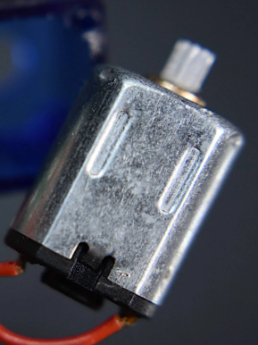
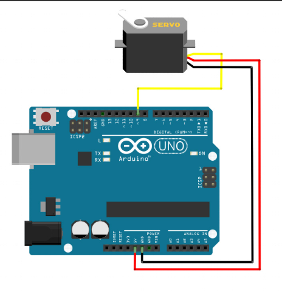

## How to Use a Servo Motor with Arduino Uno R3

## 1. How to Use the Servo Motor

A **3-pin servo motor** is controlled by a PWM signal from the Arduino.  
The Arduino sends pulse signals to set the servo position, typically between **0° and 180°**.

A standard servo has:
- **Signal** pin: receives control signal
- **VCC** pin: provides power (5V)
- **GND** pin: common ground

---

## 2. How to Connect the Servo Motor

### Identify Servo Pins (Typical Colour Code)

| Wire Colour | Function |
|------------|----------|
| Brown / Black | GND |
| Red | VCC (5V) |
| Yellow / Orange / White | Signal |

> Always check the servo label or datasheet if available.

### Wiring

| Servo Wire | Arduino Connection |
|-----------|-------------------|
| GND (Brown/Black) | GND |
| VCC (Red) | 5V |
| Signal (Yellow/Orange/White) | D9 |



> Any digital pin can be used, but **D9** is commonly used.

---

## 3. Layout (Breadboard / Direct Connection)

- Servo can be connected **directly** to Arduino pins.
- If using a breadboard:
  - Use it only for **power distribution**.
  - Ensure **Arduino GND and servo GND are connected**.

---

## 4. Arduino Code

Install the **Servo** library (usually pre-installed):  
`Arduino IDE → Sketch → Include Library → Servo`

```cpp
#include <Servo.h>

// Servo signal connected to digital pin 9
Servo myServo;

void setup() {
  myServo.attach(9);   // Attach servo to pin D9
}

void loop() {
  myServo.write(0);    // Move to 0 degrees
  delay(1000);

  myServo.write(90);   // Move to 90 degrees
  delay(1000);

  myServo.write(180);  // Move to 180 degrees
  delay(1000);
}
```
## 5. How to Verify the Servo Motor

### Expected Result
- The servo rotates to **0°**.
- Pauses for **1 second**.
- Rotates to **90°**, pauses.
- Rotates to **180°**, pauses.
- The motion repeats continuously.

---

## 6. Troubleshooting (Supplement)

### Servo Does Not Move
- Check wiring:
  - Red → **5V**
  - Brown/Black → **GND**
  - Signal → **D9**
- Ensure the servo horn is not mechanically blocked.

### Servo Jitters or Arduino Resets
- The servo may draw too much current from the Arduino.
- Use an **external 5V power supply** for the servo.
- Connect **external GND** to **Arduino GND**.

### Limited Movement
- Some servo motors do not support a full **180° rotation**.
- This is normal behaviour.
