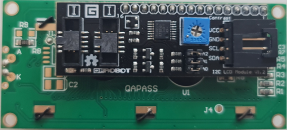
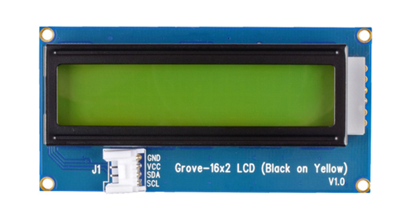
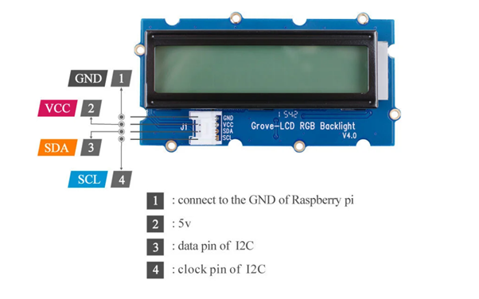

# What LCD are you using?

Please select the LCD you are using as the libraries are different.

I2C - If you look at the back of the LCD screen if you see the black module (colour may differ)

If you are using this screen, please install the library.

[https://www.arduino.cc/reference/en/libraries/liquidcrystal-i2c/](https://www.arduino.cc/reference/en/libraries/liquidcrystal-i2c/)


Grove LCD

If you are using this, please install the library below.

[https://wiki.seeedstudio.com/Grove-16x2\_LCD\_Series/](https://wiki.seeedstudio.com/Grove-16x2_LCD_Series/)


## Test Code for the I2C Screen

First, we will need to connect some wires from the Arduino to the LCD screen.


### Test Code for LCD 16x2.

If you are using a sixteen character long and 2 row LCD screen you can use the code below to test if you got it working (double, click the code before to select the code)

```
#include "rgb_lcd.h"

rgb_lcd lcd;

void setup() {

    // set up the LCD's number of columns and rows:

    lcd.begin(16, 2);

    // Print a message to the LCD.

    lcd.print("hello, world!");

}

void loop() {

  // Turn off the display:

  lcd_noDisplay();

  delay(500);

  // Turn on the display:

  lcd_display();

  delay(500);

}
```

### Test Code for LCD 20x4.

If you are using the twenty characters long and 4 row LCD screen you can use this code below to test if the device is working

```
#include <LiquidCrystal_I2C.h>
LiquidCrystal_I2C lcd(0x27, 20, 4); // set the LCD address to 0x27 for a 16 chars and 2 line display
void setup(){
  lcd.init();
}
void loop(){
  // Print a message to the LCD
  lcd.backlight();
  lcd.setCursor(0, 0);
  lcd.print("Hello, world!");
  lcd.setCursor(0, 1);
  lcd.print("Ywrobot Arduino!");
  delay(1000);
  lcd.setCursor(0, 2);
  lcd.print("Arduino LCM IIC 2004");
  lcd.setCursor(0, 3);
  lcd.clear();
}
```

### Test Code for Grove LCD Screen

```#include
rgb\_lcd lcd;

void setup() 

{

    // set up the LCD's number of columns and rows:

    lcd.begin(16, 2);

    // Print a message to the LCD.

    lcd.print("hello, world!");

    delay(1000);

}


void loop() 

{

    // set the cursor to column 0, line 1

    // (note: line 1 is the second row, since counting begins with 0):

    lcd.setCursor(0, 1);

    // print the number of seconds since reset:

    lcd.print(millis()/1000);

    delay(100);

}
```

